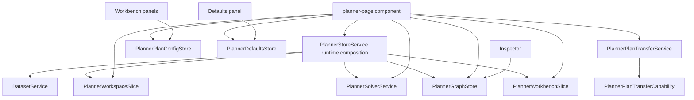
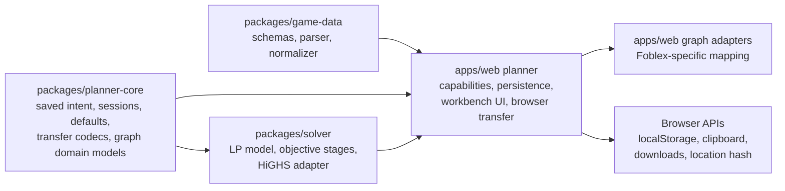

# Architecture

Beltwise is split into framework-independent domain packages plus one Angular shell.

- `packages/game-data` owns generated data schemas, tuple parsing, raw docs normalization, stable JSON output, recipe availability categories, generator fuel option extraction, and the fixture dataset.
- `packages/planner-core` owns saved workspace/project state, sessions, user defaults, plan import/export/share codecs, objective presets, resource limit contracts, sink rules, target-output sink allocations, power generator catalog helpers, solver result shapes, renderer-neutral graph models, graph display settings, and layout preservation.
- `packages/solver` owns the pure LP model builder, objective-stage construction, power-target constraints, and solver adapters. Angular does not assemble LP coefficients.
- `apps/web` owns UI state orchestration, local persistence, transfer services, planner controls, Sinks/Plan workbench surfaces, and the Foblex Flow adapter/component layer.

## Application Map

The high-level data path keeps raw game docs, domain modeling, solver behavior, and graph rendering in separate layers:

```mermaid
flowchart LR
  RawDocs["Satisfactory en-US.json"] --> Extractor["scripts/extract-satisfactory-data"]
  Extractor --> Dataset["Compact GameDataset JSON"]
  Dataset --> DatasetService["apps/web DatasetService"]
  DatasetService --> PlannerCapabilities["Planner state capabilities"]
  PlannerCapabilities --> Solver["packages/solver"]
  Solver --> SolverResult["Solver result"]
  SolverResult --> GraphModel["packages/planner-core graph model"]
  GraphModel --> GraphFeature["apps/web graph feature"]
  GraphFeature --> Foblex["Foblex Flow adapter/component"]
```

The planner page is a composition shell. It may construct the runtime store, but feature UI should bind to the capability that owns the behavior:

The main dependency rule is that stable project intent and domain models point inward, while browser, Angular, and renderer specifics stay at the app edge:

## Web Feature Structure

Angular features stay vertically organized under `apps/web/src/features`. A feature folder should keep its entry component easy to find at the feature root, then use local subfolders when a feature grows enough that a flat folder stops being a useful map.

The planner feature is the reference example:

- `apps/web/src/features/planner/planner-page.component.*` is the planner entry point and route target.
- `apps/web/src/features/planner/state` owns the runtime store, workspace slice, capability stores, selectors, and intent mutations.
- `apps/web/src/features/planner/workbench` owns planner section, panel, and inspector UI used by the workbench.
- `apps/web/src/features/planner/solving` owns Angular-side solve input selection, scheduling, and solver service integration.
- `apps/web/src/features/planner/transfer` owns JSON import/export and share-link browser orchestration.
- `apps/web/src/features/planner/persistence` owns local workspace persistence and persistence coordination.
- `apps/web/src/features/planner/shared-ui` owns small planner-local UI primitives and formatting/filtering helpers.

New planner code should start in one of those subfolders instead of re-flattening the planner root. Keep tests colocated with the module they verify. Prefer local relative imports inside the feature; do not add barrel files unless they hide real complexity rather than just shortening paths.

The graph feature uses a renderer seam:

- `apps/web/src/features/graph/production-graph.component.*` owns the Angular graph surface.
- `apps/web/src/features/graph/adapters` owns Foblex-specific mapping, display formatting, connection builders, and tooltip presenters.

Renderer-specific types stay in `apps/web/src/features/graph`. Persisted projects and `planner-core` graph models are renderer-neutral.

## Planner State Capabilities

`PlannerStoreService` is the planner runtime/composition service. It starts persistence coordination, wires dataset and workspace initialization into solver scheduling, coordinates workspace activation hooks, and flushes pending graph positions on destroy.

Feature code should depend on the capability that owns the use case instead of routing through the runtime service:

- `PlannerWorkspaceSlice` owns sessions, active-session plan lists, plan lifecycle commands, and global user-default application when new plans are created.
- `PlannerPlanConfigStore` owns active-plan product targets, power targets, sink rules, inputs, recipe/machine/resource settings, objective settings, plan notes, and persisted graph display intent.
- `PlannerDefaultsStore` owns global defaults for future plans, including mirrored recipe, machine, resource, objective, and display settings.
- `PlannerGraphStore` owns renderer-neutral graph read models, selection, inspector state, build-state node flags/notes, layout locks, and node-position flushing.
- `PlannerPlanTransferService` and `PlannerPlanTransferCapability` own browser import/export/share orchestration and the narrow ports needed to prepare imported projects.
- `DatasetService`, `PlannerSolverService`, and `PlannerWorkbenchSlice` own dataset loading, solve scheduling/status, and workbench panel/focus state.

Do not reintroduce broad convenience command forwards on `PlannerStoreService`. New tests should cover the capability interface used by the consumer; runtime-store tests should stay focused on composition, persistence/solver wiring, lifecycle hooks, and workspace initialization.

Future optional capabilities should consider plugin-shaped extension seams before they become built-in planner behavior. See [Plugin-Shaped Extension Seams](./rfc/plugin-extension-seams.md) for the current guidance. Runtime third-party plugins are not an accepted architecture decision.

The generated data pipeline is build-time only. Raw `en-US.json` is read by `scripts/extract-satisfactory-data` and normalized into `apps/web/public/data/satisfactory-current.json`, which is what the Angular app serves.

The production solver uses a continuous LP model solved by HiGHS through `packages/solver`. The model builder, objective preset stage mapping, HiGHS adapter, and solution-to-plan mapping stay framework-independent so Angular can treat solving as an application service dependency.

Default graph positions are generated from renderer-neutral graph data before the Foblex adapter maps that data into Angular/Foblex view models. The current layout implementation uses Dagre; that can be replaced without changing persisted project shape or solver output.

Solver output is not persisted as authoritative state. Workspaces persist sessions, global user defaults, and standalone plans. Plans persist product targets, power targets, sink rules, recipe/machine/resource/input configuration, objective profile, graph display settings, plan notes, build-state node notes, and manual node positions, then rerun the solver when loaded.

The current graph model can represent raw resources, external inputs, assumed inputs, recipe groups, power generator targets, requested outputs, byproducts, and AWESOME Sink endpoints. Sink and power nodes are derived from solved flows plus persisted user intent; renderer-specific Foblex handles, positions, and visual connection details stay in the graph feature layer.

HiGHS is loaded through the `highs` JavaScript/WASM package, but Beltwise patches the loaded wrapper to read raw solution output rather than the wrapper's truncated pretty output. See [ADR 0007](./adr/0007-read-raw-highs-solution-output.md).
