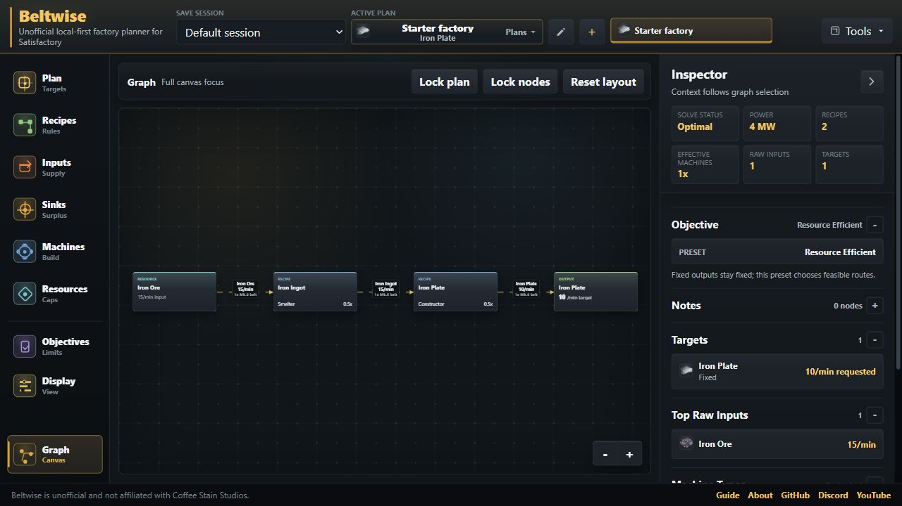
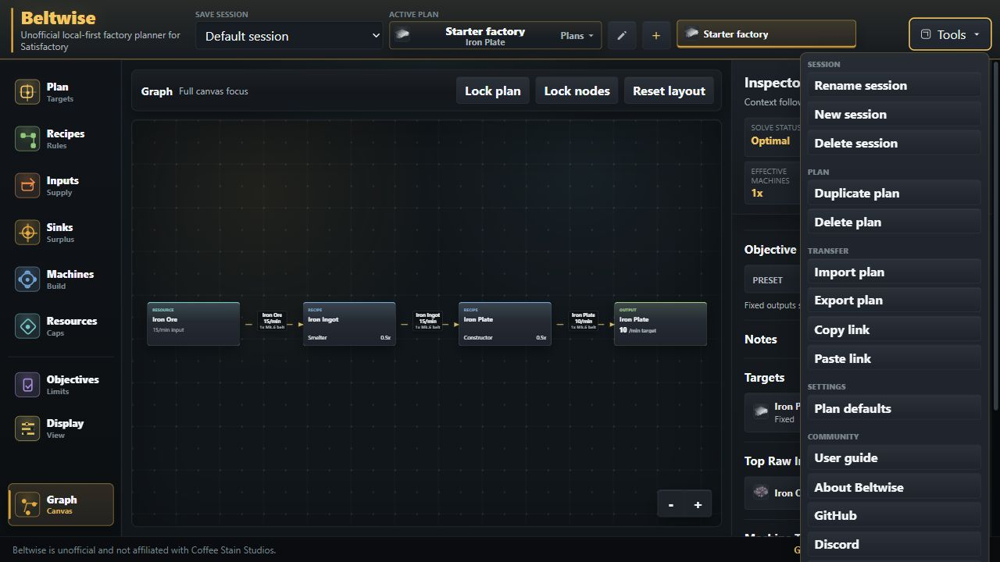
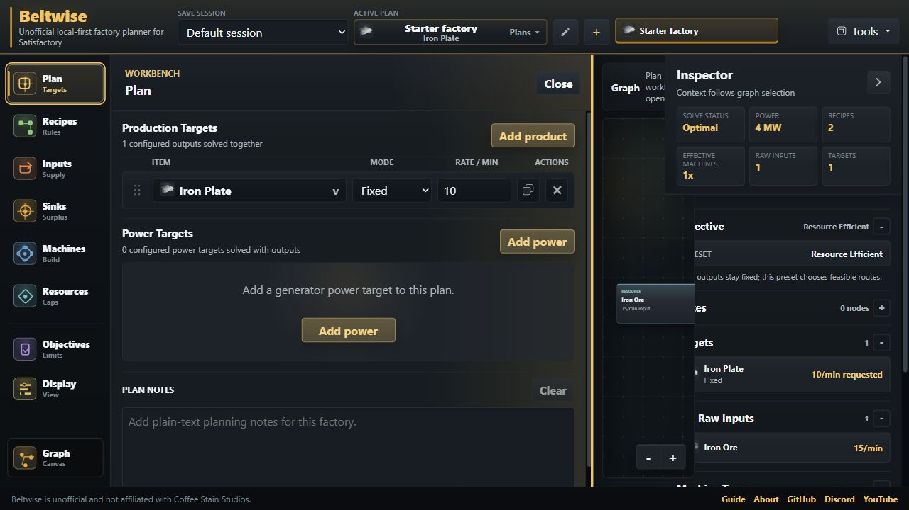

# Beltwise User Guide

Status: beta help copy for people using the hosted planner.

Beltwise is an unofficial, local-first factory planner for Satisfactory. It helps
turn desired outputs into a solved production graph with recipe choices, machine
counts, power targets, resource limits, external inputs, sink routes, and notes.

## Quick Start

1. Open the planner.
2. Use the active plan controls in the top bar to rename the starter plan if you
   want a clearer name.
3. Open **Plan** from the left rail.
4. Add or edit output targets. Choose an item, then set a fixed rate such as
   `60/min`, or set a target to maximize when you want the solver to find the
   highest feasible rate.
5. Wait for the graph to solve. The graph updates from stored plan settings; the
   solved result itself is not saved as permanent state.
6. Use the graph and inspector to check recipes, machines, raw inputs, byproducts,
   power, sink routes, and warnings.
7. Export important plans from **Tools** when you want a portable backup or want
   to move a plan to another browser.

## Sessions And Plans

The top bar separates a **save session** from the **active plan**.

- A session is a local group of plans for one game world or planning context.
- A plan is one solved factory request inside that session.
- The visible plan chips switch between recent plans in the current session.
- The larger active-plan control opens the full plan selector.
- The plus button creates a new plan in the active session.
- **Tools** contains rename, duplicate, delete, import, export, share, and default
  settings actions.

Deleting a session can delete every plan inside it. Export anything important
before clearing browser data, switching devices, or doing beta cleanup work.

## Workbench Sections

The graph is the main planning surface. The left rail opens workbench panels for
changing plan inputs and display settings.

| Section    | Use it for                                                                     |
| ---------- | ------------------------------------------------------------------------------ |
| Plan       | Production targets, power targets, and plan notes.                             |
| Recipes    | Base, unlock, converter, and alternate recipe enablement.                      |
| Inputs     | Items supplied externally by another factory or manual source.                 |
| Sinks      | Surplus sink rules and target-output sink allocations.                         |
| Machines   | Machine availability and current solved machine usage.                         |
| Resources  | Raw resource caps for this plan.                                               |
| Objectives | Solver preference presets, custom weights, and raw-resource route preferences. |
| Display    | Belt/pipe display tiers, rate precision, edge style, labels, and animation.    |

## Output Targets

Output targets define what the plan should produce.

- Fixed targets ask for a specific amount per minute.
- Maximize targets ask the solver to find the best feasible amount under the
  current recipes, inputs, machines, resources, and objectives.
- Multiple output targets can be solved together in one plan.
- Fixed output target rates can also be edited from selected output nodes in the
  graph.
- Power targets are explicit generator/fuel requests. Beltwise reports generated
  MW, generator count, fuel demand, supplemental inputs, and byproducts from the
  solved plan.

If a maximize target has no practical ceiling, Beltwise shows **Plan needs a
limit**. Add resource caps, recipe constraints, inputs, or another limiting
condition so the solver can choose a finite answer.

## Recipes, Inputs, Resources, And Machines

Recipe choices and availability can change the shape of a plan dramatically.

- Standard and deterministic unlock recipes are enabled by default.
- Alternate and converter recipes are opt-in so beta plans do not silently depend
  on hard-drive or conversion routes you have not chosen.
- Inputs represent items supplied from outside this plan. They are useful when one
  factory feeds another.
- Resources set raw map caps for this plan. Disable or lower a resource when a
  save has a shortage or you want to force a different route.
- Machines let you disable machines that are not available or not desired.

When Beltwise says **Plan cannot be built**, check the disabled recipes, raw
resource caps, machine availability, and external inputs first.

## Graph Basics

The graph turns the current solve into a readable factory flow.

- Click a node to select it.
- Selection highlights the selected node, directly connected nodes, and directly
  connected edges.
- Use **Clear selection** or `Esc` to clear the selected node.
- Drag nodes to arrange the graph. Manual positions are saved with the plan.
- **Reset layout** clears manual node positions.
- **Lock nodes** prevents node movement while leaving selection, notes, done
  state, and editable output targets available.
- **Lock plan** prevents solve-relevant edits while you review or build from the
  plan.

Some nodes are derived from solver results:

- Output nodes represent requested product targets.
- Recipe nodes represent active production recipes.
- Resource nodes represent raw extraction.
- Input nodes represent items supplied externally.
- Sink nodes represent configured sink rules that have solved material to sink.
- Power nodes represent configured generator/fuel targets.
- Assumed input nodes can appear when a power target or production chain needs an
  item that this plan does not currently solve locally.

## Inspector, Build Tracking, And Notes

The right inspector changes based on selection.

- With no node selected, it summarizes the active plan and visible notes.
- With a node selected, it shows node details, done state, and node notes.
- Double-click a graph node to toggle its done state.
- Node notes and done flags are saved with the plan.
- Notes that no longer match a visible solved node are preserved instead of being
  deleted automatically.

Use plan notes for high-level intent and node notes for build reminders such as
location, blueprint count, belt tier decisions, or what remains unfinished.

## Plan Defaults

**Tools > Plan defaults** edits settings that are applied only to newly created
plans. Existing plans keep their own settings.

Defaults currently cover recipe, machine, resource, objective, and display
settings. They are stored locally with the workspace and are not included in a
single-plan export.

## Import, Export, And Share Links

Beltwise stores plans locally in the browser, so transfer tools are important
during beta.

- **Export plan** downloads readable Beltwise JSON for the active plan.
- **Import plan** adds a Beltwise JSON plan to the active session and re-solves it
  with the current app dataset.
- **Copy link** copies a compact self-contained plan link or code.
- **Paste link** imports a copied Beltwise plan link or code.

Exports and share links contain plan intent: targets, power targets, sink rules,
recipe and machine settings, resource caps, external inputs, objectives, graph
display/layout, notes, and build state. They do not include whole-session state,
global new-plan defaults, save-game data, account data, or authoritative solver
output.

## Local Storage And Privacy

Beltwise is local-first. Current beta workspace data is stored in browser
storage on the device where you use the app.

- Plans are not synced to an account.
- Plans are not stored on a Beltwise server.
- Clearing site data can remove local sessions, plans, and defaults.
- A different browser profile or device will not see your existing local plans
  unless you import an exported plan or share code.

Export plans you care about before clearing browser data or changing machines.

## Beta Limitations

Beltwise is useful today, but the beta is still intentionally focused.

- Save-file import is not part of the current beta.
- Randomized resource node seeds are not part of the current beta.
- Session-wide logistics, map planning, train planning, and linked factory
  contracts are future work.
- Share and export are plan-level, not whole-session backup tools.
- The app is desktop-first. Smaller screens can inspect plans, but graph-heavy
  planning is best on a larger display.
- Solver output should be treated as derived planning guidance. Re-check important
  build decisions in game, especially while data and planner behavior are still
  moving during beta.

## Reporting Beta Feedback

The most useful beta reports include:

- What you were trying to plan.
- The item targets, power targets, recipes, inputs, resources, and machines that
  matter to the issue.
- Whether the problem appears after refresh or import.
- A screenshot if the issue is visual.
- An exported plan JSON or share link when the issue depends on plan state.

Use the links in the app to report issues on GitHub or discuss beta feedback on
Discord.
